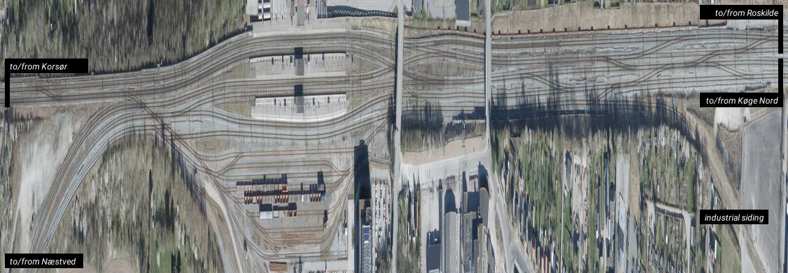
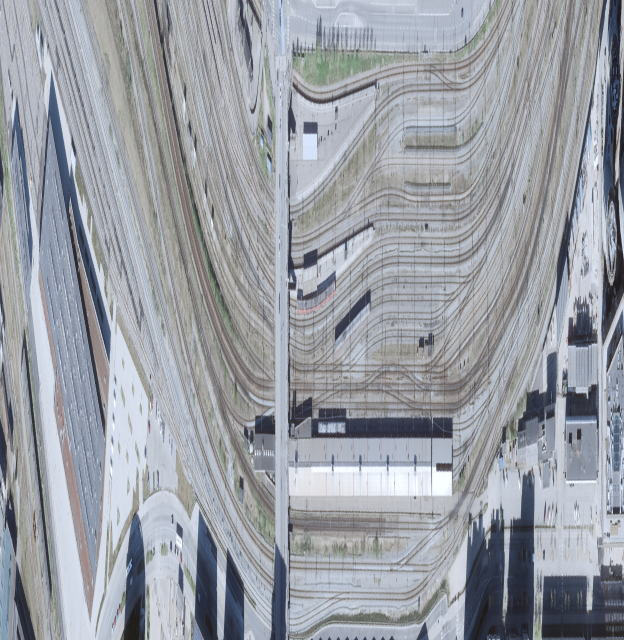
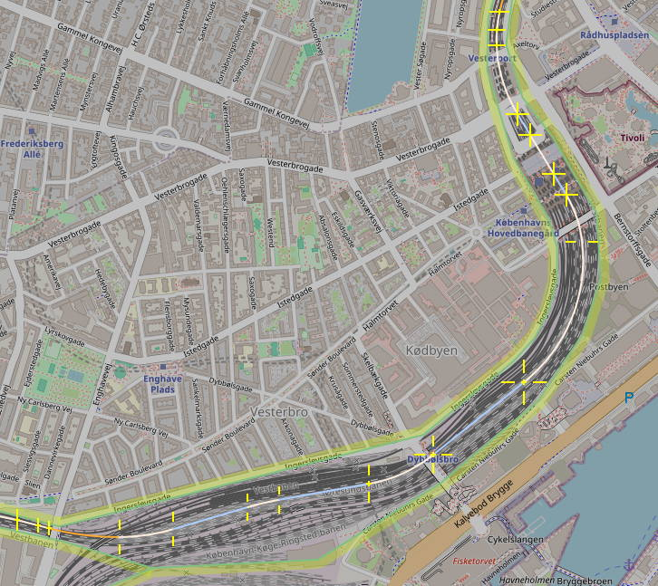
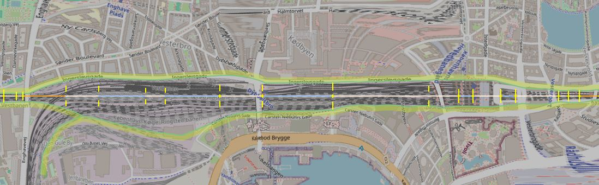
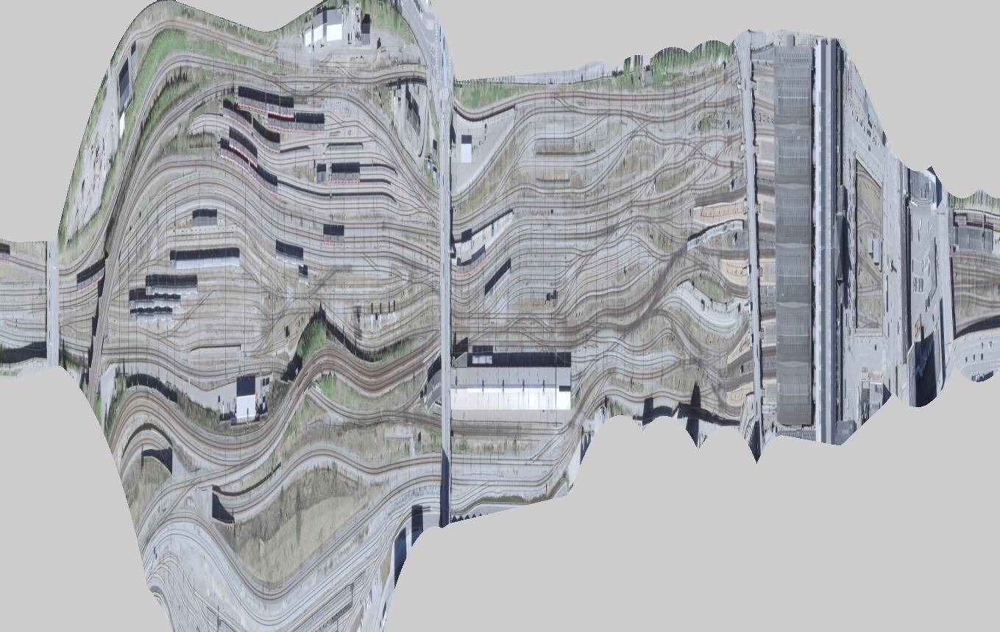
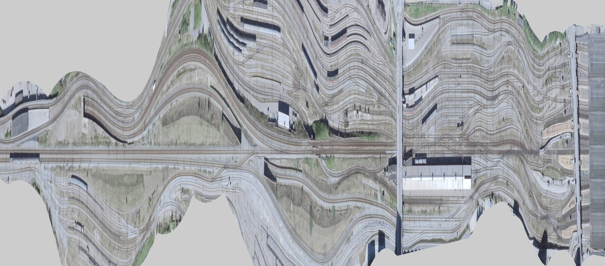

# Mapwarper: what is it, and why?

Railway track layouts have always fascinated me. In particular,
understanding the operational ideas behind the infrastructure: Which
platforms can be reached from which lines? Which movements can happen
in parallel without conflict? If _this_ piece of track is damaged,
what are the possible workarounds? And so forth.

Back in my youth, the only way to find out the layout for a
non-insider like me was to stand on the platform (or a footbridge or
streetbridge if one is available) with binoculars and a drawing pad.
For the parts you couldn't see from there, you had to ride the train
(again and again), scribbling frantically on the drawing pad while
looking out the window.

Then, somewhen around the turn of the millennium, providers on the
World Wide Web (such as Google's Maps services) began providing
aerophotos with sufficient resolution to see individual tracks.  The
trouble with that, from the perspective of a layout nerd, is that
switches are long and thin, so when you've zoomed in far enough to see
the tracks, it's easy to lose sight of the big picture and how the
switch you're looking at _now_ connects to the other one, several
screenfuls of photo away.

Now, one solution to this is to make a sequences of screenshots of the
aerophotos and stitch them together in a suitable image editor, after
which you can turn the whole thing and scale it by different factors
along vs across the line.

This can work pretty nicely, provided only the station in question
deigns to be _straight_. Here is one example of that, Ringsted in
Denmark:

  
(Modified orthophoto from
[@geodanmark](https://www.geodanmark.dk/home/vejledninger/vilkaar-for-data-anvendelse/),
CC-BY-4.0)
When you think about it, this layout doesn't make much sense, but you
can _see_ how it doesn't make sense. Yes, that is two parallel double
tracks leaving the station on the right. Yes, that is a plain diamond
crossing to the right of the platforms.

On the other hand, when the railway is _curved_, this strategy fails.
Here's an attempt to depict the approaches to Copenhagen Central
station in the same way. There's a straight section of some 350 meters
to the right of the _Dybbølsbro_ bridge where you can see what's going
on, but beyond that, the overall curvature of the line quickly makes
everything unrecognizable.

  
(Modified orthophoto from
[@geodanmark](https://www.geodanmark.dk/home/vejledninger/vilkaar-for-data-anvendelse/),
CC-BY-4.0)

The Mapwarper program is a project to solve this problem. The program
simply _staightens out the railway_ by bending ("warping") the
aerophoto before it gets compressed lengthwise.

How this works is: First I use a mouse-and-keyboard GUI to define the
smooth guiding curve on a map background. This is the curve that will be
straightened out later in the process.

  
(Background map from OpenStreetMap,
© [OpenStreetMap contributors](https://www.openstreetmap.org/copyright))

(The different colors of the segments guiding curve are annotations
that help define how to the program computes a smooth curve through
the yellow anchor points. The green lines are separately drawn bound
lines that help define the areas for which aerophoto map tiles will be
downloaded later).

Next the program straightens out the map centered on the guiding
curve, which might look something like this:

  
(Transformed from OpenStreetMap, still
© [OpenStreetMap contributors](https://www.openstreetmap.org/copyright))

Conceptually, each _vertical column_ of pixels in this image arises
from drawing a line perpendicular the guiding curve at one point, and
noting down what's on that line. The effect is somewhere between [slit
photography](https://en.wikipedia.org/wiki/Strip_photography) and a
deliberate [rolling
shutter](https://en.wikipedia.org/wiki/Rolling_shutter) effect. Near
(and beyond) the centers of curvature of the guiding curve the map
gets heavily distorted, but on the line itself the distortion is not
immediately apparent.

All that remains is to replace the base map by aerophotos and squeeze
the whole thing together lengthwise, and then you have a nice overview
of the station showing how everything (at least the part of
everything that is visible from above) fits together:

  
(Transformed orthophoto from
[@geodanmark](https://www.geodanmark.dk/home/vejledninger/vilkaar-for-data-anvendelse/),
CC-BY-4.0)

The program automatically figures out which parts of the aerophoto
collection to download in order to render the area between the green
boundary definitions.

The GUI for editing the guiding curve can also show the aerophotos
themselves as background rather than OpenStreetMap tiles, and it works
even in the warped projection itself! This gives very precise control
of where you put the guiding curve, and near instantaneous feedback on
what the resulting warp looks like. With a bit of practice, one can
get the guiding curve to follow a particular track quite accurately,
which makes that track absolutely straight in the warped output (at
the expense of often making its neighboring tracks quite wavy).

  
Departure from platform 6 towards Køge Nord, and thence Ringsted.
(Transformed orthophoto from
[@geodanmark](https://www.geodanmark.dk/home/vejledninger/vilkaar-for-data-anvendelse/),
CC-BY-4.0)

